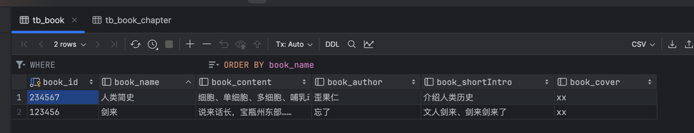
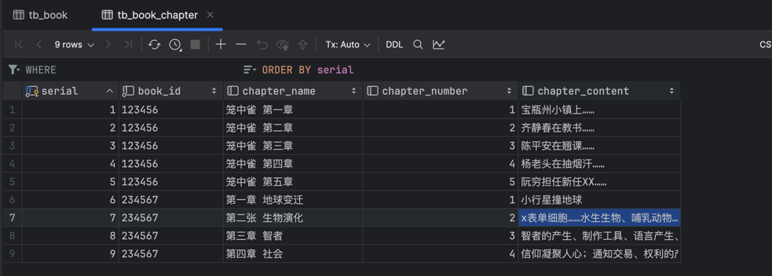
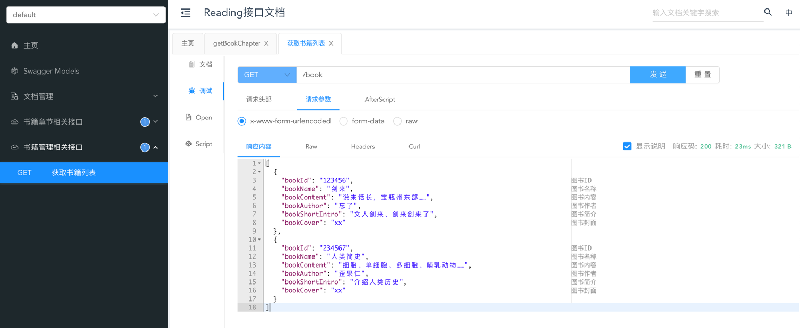
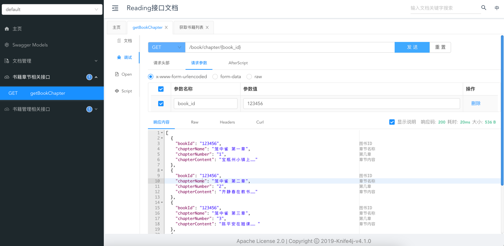

reading 服务端项目
------------------------------------------

开发记录：

接口地址：http://localhost:8081/doc.html

书籍表字段 和 插入的数据示例图：

书籍章节表字段 和 插入的数据示例图：

获取书籍列表接口调试：

获取书籍章节列表接口调试：

------------------------------------------